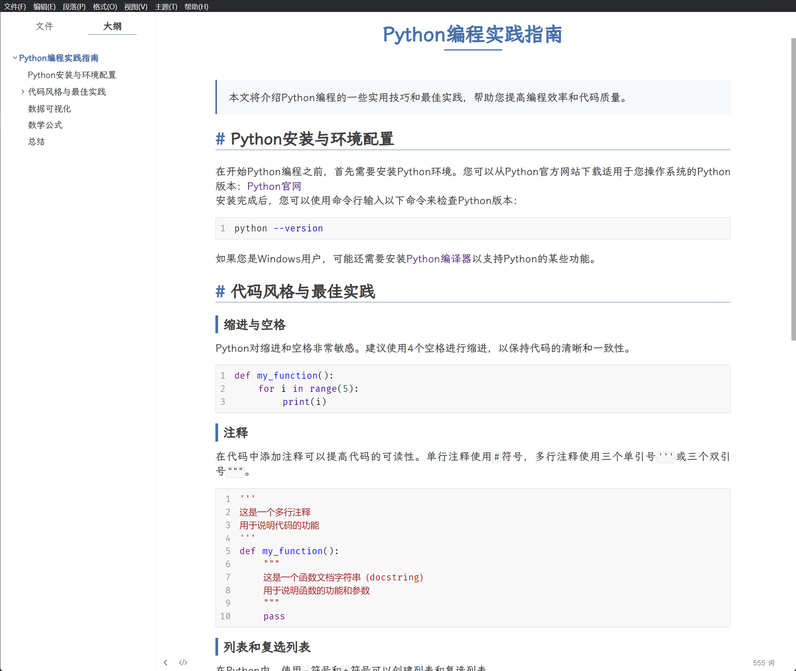
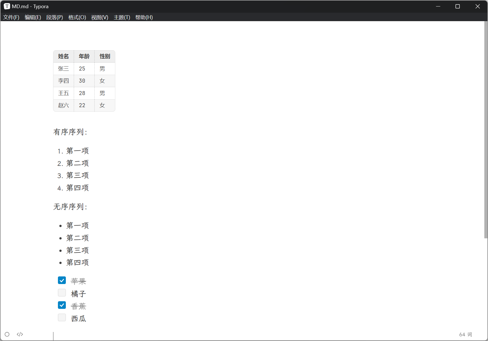

# Typora-theme-elegant

一款用于自己使用的 [Typora](https://typora.io/) 主题设计，灵感来自于主题 [redrail](https://github.com/airyv/typora-theme-redrail) 。

文本字体使用[霞鹜文楷](https://github.com/lxgw/LxgwWenKai)，代码字体使用 [FiraCode](https://github.com/tonsky/FiraCode) ，并同时进行了一些 `md` 元素的修改。

如果您喜欢这个主题，请点击 `stra` ，感谢您的关注！ 

## 安装主题

## 主题效果展示

## 主题更新

**创建于 2024 年 3 月 3 日**
